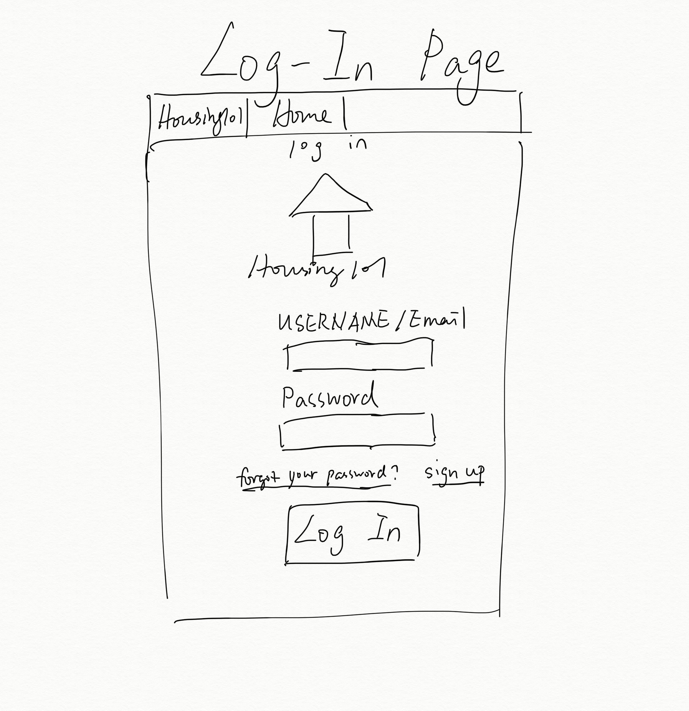
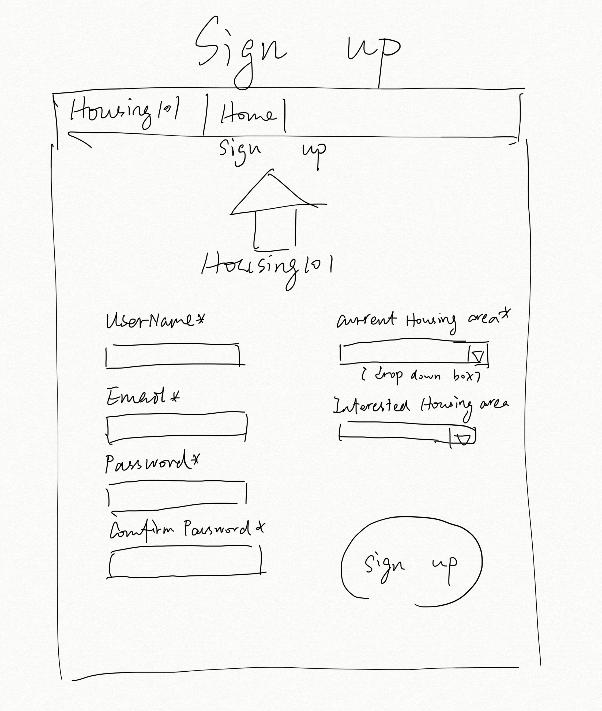
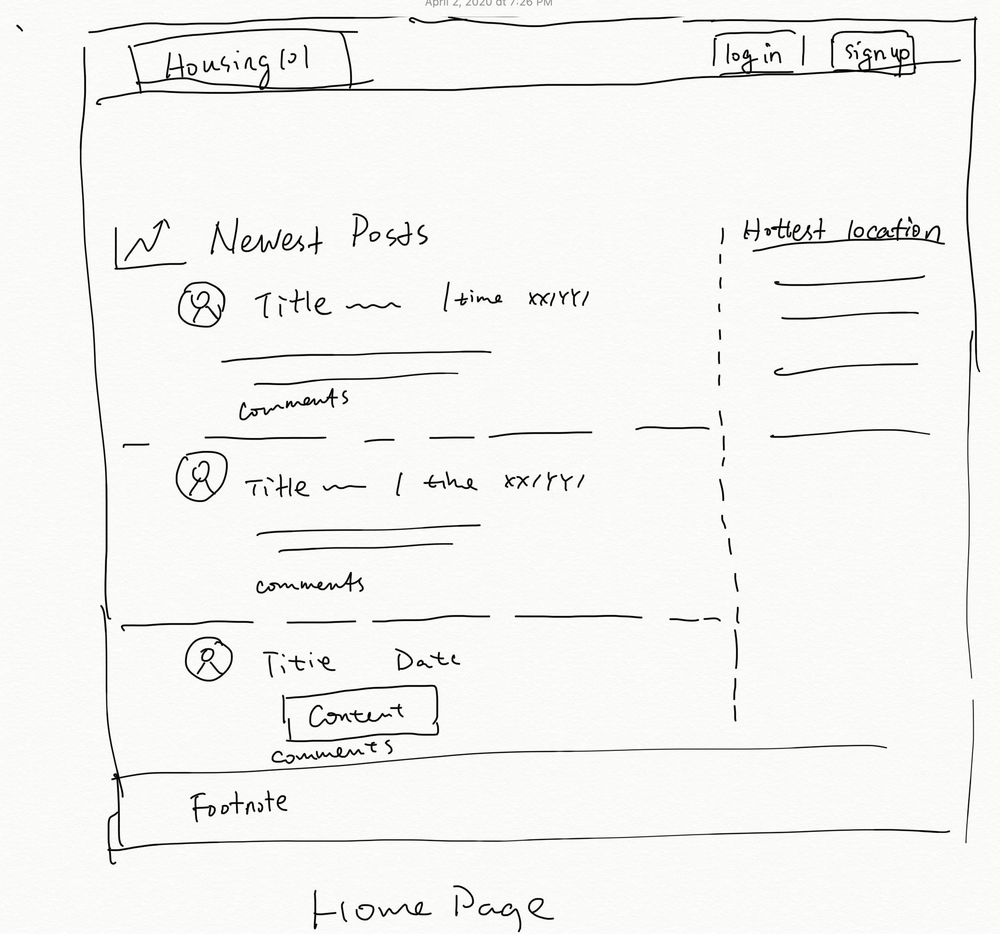
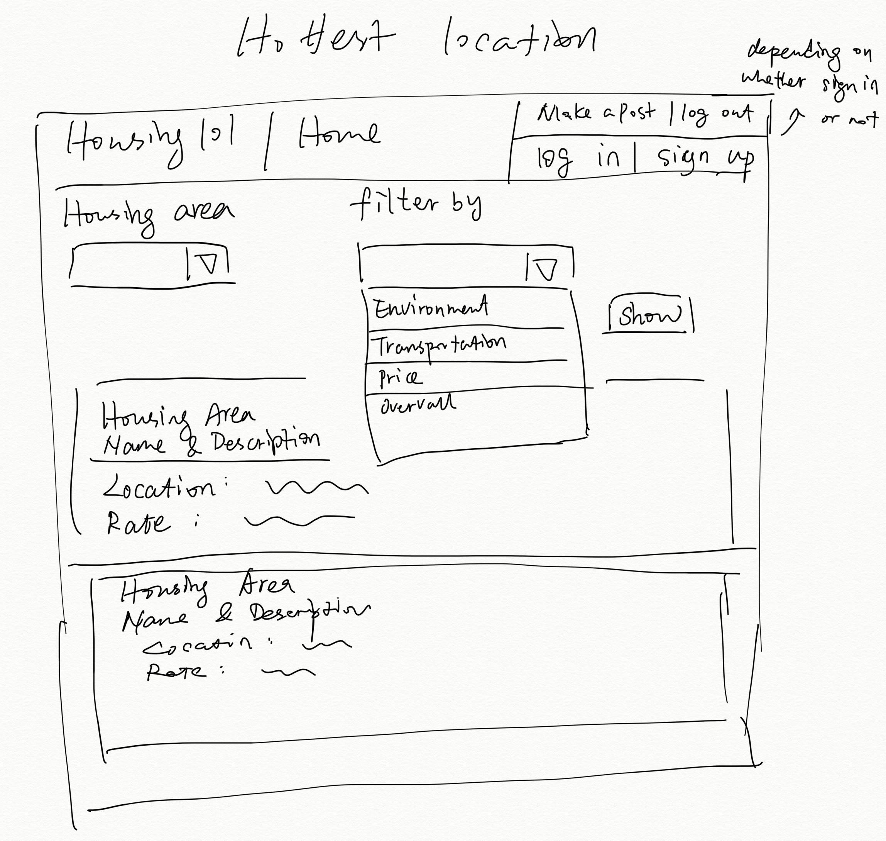
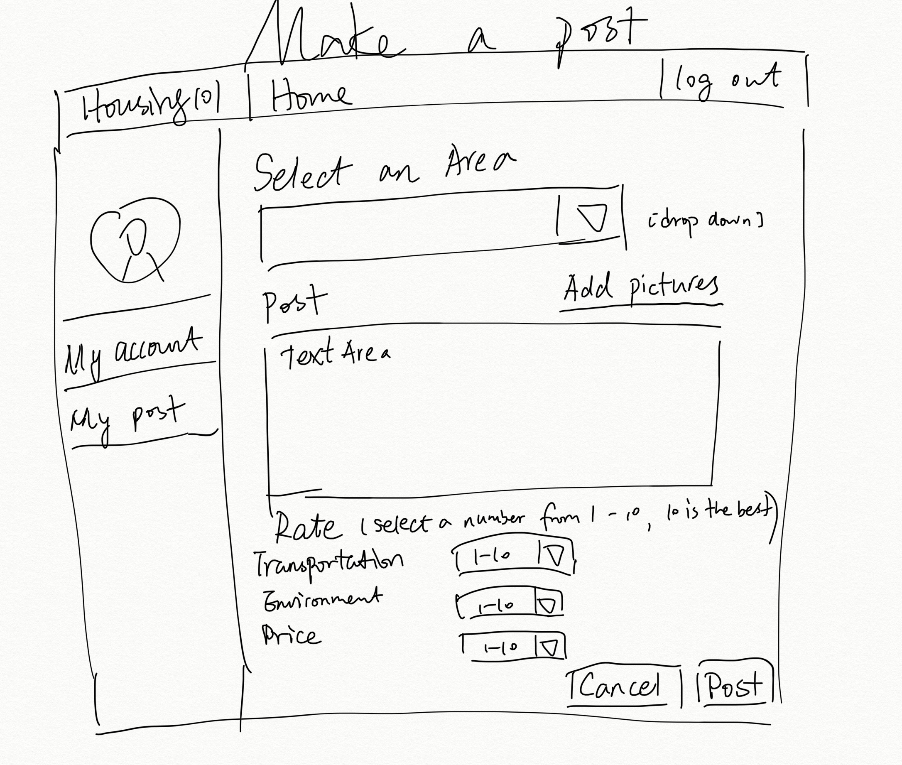
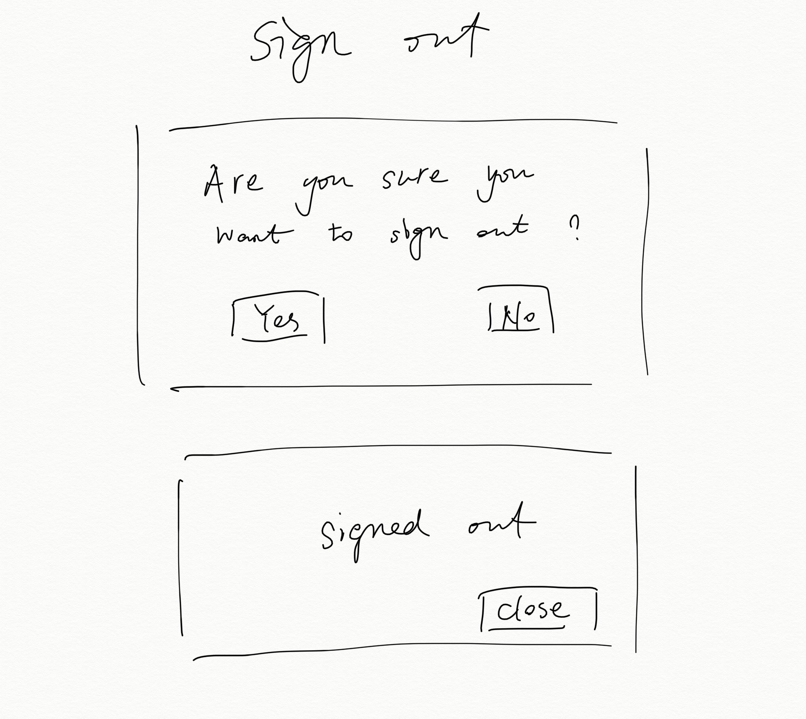
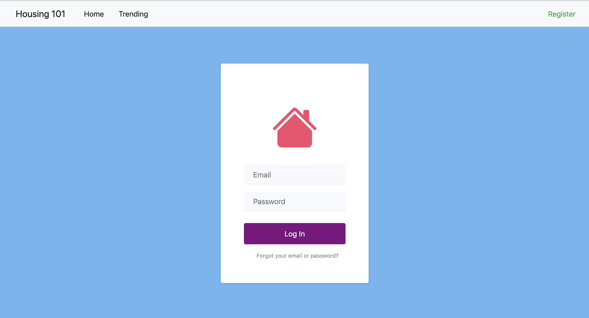
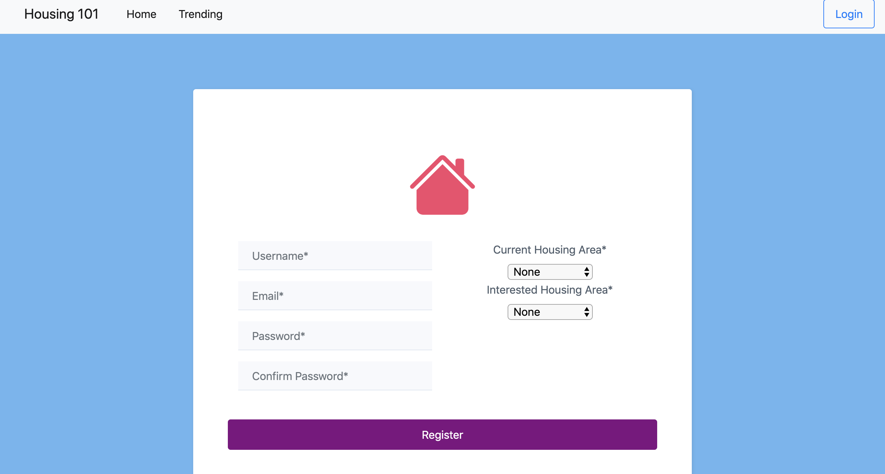
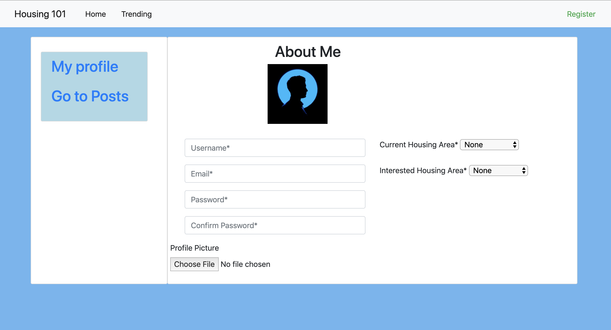
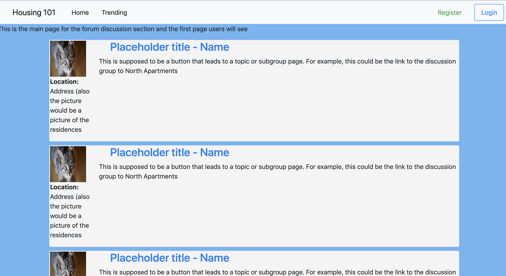

### Part 0: Data Interactions
#### User Components
  * Email
  * Username & ID
  * User portrait
  * Password (encrypted in database)
  * User posts
  * User messages
  * User current housing area / interested housing area
  * User group / by default = housing area

#### Posts
  * User
  * Date
  * Images
  * Content
  * housing area
  * Rate (transportation, environment, price...)

#### Housing Area
  * Name & Description
  * Location
  * Avg Rate (calculated from users' posts)
  
#### Market Place (optional)
  * housing area
  * User
  * bid

### Part 1: Wireframes

#### **Login**

#### **Register**

#### **Homepage**

#### **Hottest Location**

#### **Make a post**

#### **My profile**

#### **Sign out**

### Part 2: HTML and CSS

#### **Login**

#### **Register**

#### **Register**

#### **Register**

### Part 3: Breakdown and Division
#### 
  * Juelin Liu: Write the HTML and Javascript for posts page and user_profile page, Using bootstrap to build the top bar for all pages
  * Alex Zhang: Write the HTML for homepage posts, adjust the main.css file
  * Erin(Yuxin) Liu: Write the HTML for register and modify the HTML for profile page and homepage.
